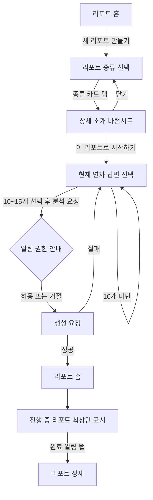
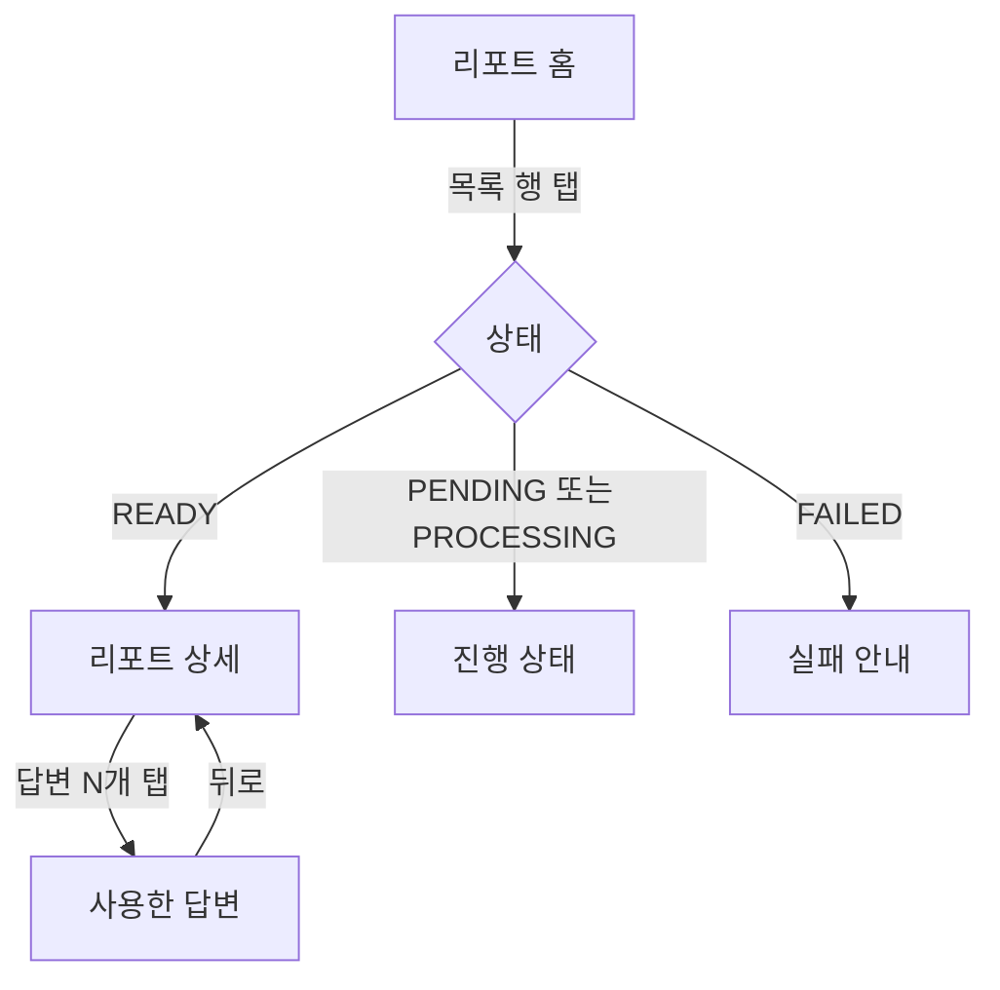

# AI 리포트 UI/UX 기획

- 작성일: 2026-08-11
- 상태: 확정
- 연관 문서:
  - `docs/ai-analysis-feature-plan.md` — 최초 기능·상태·API 제안
  - `docs/planning/ai-분석-리포트-이용정책-기능기획.md` — 이용 횟수·현재 연차·결과 포맷 정책
- 적용 범위: 리포트 진입점, 홈, 생성, 목록, 결과 상세, 사용한 답변 화면
- 제외 범위: 연차 선택 UI, 홈 질문 기록의 연차별 탐색, Source API 상세 계약

이 문서는 `docs/ai-analysis-feature-plan.md`의 UI/UX 설계(§3, §4, §8)를 대체한다. 상태머신과 서버 계약은 확정된 최신 API 문서를 우선한다.

## 0. 설계 목표와 현재 UI 평가

### 0.1 목표

리포트 탭을 일회성 AI 생성 도구가 아니라 **생성한 리포트를 다시 읽고 관리하는 독립 공간**으로 바꾼다. 새 리포트 생성은 이 공간의 주요 행동이지만, 이미 만든 리포트의 열람보다 앞서지 않는다.

앱은 장기적으로 질문·답변과 리포트를 사용자별 연차 단위로 관리한다. 이번 범위에서는 연차 선택 UI를 만들지 않고 **현재 연차 데이터만 암묵적으로 사용**한다. 화면 구조는 추후 리포트 목록 상위에 연차 필터를 추가할 수 있도록 유지한다.

### 0.2 현재 UI의 장점

- AI 분석이 비동기라는 점을 진행 카드와 알림 안내로 설명한다.
- 리포트 종류별 캐릭터와 카피가 분명하고 친근하다.
- 최소 10개·최대 15개의 답변 선택 규칙과 하단 고정 CTA가 명확하다.
- 결과 유형에 따라 섹션형 분석과 편지형 결과를 다르게 렌더링한다.

### 0.3 개선이 필요한 점

- 리포트 탭의 첫 화면이 생성 가능한 종류 카드 중심이고, 기존 리포트는 작은 `리포트 목록` 링크로 밀려 있다.
- 랜딩과 별도 히스토리 화면이 나뉘어 리포트 열람에 불필요한 한 단계가 생긴다.
- 탭 라벨 `만남`은 기능을 바로 설명하지 못한다.
- 현재 목록 행은 타입과 월/일만 표시해 답변 수와 처리 상태를 충분히 구분하지 못한다.
- 결과 상세에서 분석에 사용한 질문·답변을 확인할 수 없다.
- 리포트 정책 문서는 종류당 월 2회를 규정하지만 기존 UI 카피와 타입에는 주 1회 `COOLDOWN` 표현이 남아 있다.

## 1. 사용 맥락

- 기기 우선순위: iOS·Android 모바일, 360–420dp 폭
- 사용 상황:
  - 새 분석을 맡기고 앱을 떠난 뒤 알림을 통해 다시 진입한다.
  - 이전 리포트를 차분히 다시 읽는다.
  - 결과의 근거가 궁금할 때 분석에 사용한 답변을 확인한다.
- 조작: 한 손 세로 사용을 기본으로 하고, 주요 진입점은 하단 탭과 화면 상단에 둔다.
- 사용자 숙련도: 첫 진입에서도 `리포트`의 의미와 생성 방법을 별도 학습 없이 이해해야 한다.
- 톤: 친근하고 다정하지만, AI 결과를 정답처럼 권위적으로 표현하지 않는다.

## 2. 정보 구조

### 2.1 하단 탭

리포트는 다음 이유로 독립 하단 탭을 유지한다.

- 생성 후 비동기 결과를 확인하기 위해 반복해서 돌아오는 목적지다.
- 리포트가 누적되면 열람과 관리의 가치가 커진다.
- 홈의 오늘 질문·과거 답변 탐색과 리포트 열람의 목적이 다르다.
- 추후 연차별 리포트 탐색을 추가할 때 독립 공간이 확장에 유리하다.

표시 규칙:

- 하단 탭 라벨: `리포트`
- 리포트 홈 제목: `나를 만나는 시간`
- 기존 `만남`은 탭 라벨로 사용하지 않는다.

### 2.2 화면 목록

| 화면 | 목적 | 진입 경로 | 제안 라우트 |
| --- | --- | --- | --- |
| 리포트 홈 | 생성 진입, 진행 상태, 전체 리포트 열람 | 하단 `리포트` 탭 | `/(tabs)/analysis` |
| 리포트 종류 선택 | 만들 리포트의 종류 비교 | 홈 `새 리포트 만들기` | `/(tabs)/analysis/create` |
| 답변 선택 | 분석할 현재 연차 답변 10–15개 선택 | 종류 소개 시트 CTA | `/(tabs)/analysis/select?type=...` |
| 리포트 상세 | 생성 결과 읽기와 평가 | 목록·완료 알림 | `/(tabs)/analysis/[id]` |
| 사용한 답변 | 생성 당시 질문·답변 스냅샷 확인 | 상세 헤더 `사용한 답변` | `/(tabs)/analysis/[id]/sources` |

기존 `/(tabs)/analysis/history`의 목록 책임은 리포트 홈으로 합친다. 구현 시 기존 딥링크나 내부 진입점이 있다면 홈으로 안전하게 대체한 뒤 라우트 제거 여부를 결정한다.

### 2.3 화면 관계

```text
하단 리포트 탭
      │
      ▼
┌─────────────┐   새 리포트 만들기   ┌─────────────┐
│ 리포트 홈    │ ─────────────────▶ │ 종류 선택    │
│ 목록·진행상태 │                    └──────┬──────┘
└──────┬──────┘                    상세 소개 시트
       │ 리포트 선택                       │ 이 리포트로 시작하기
       │                                   ▼
       │                            ┌─────────────┐
       │                            │ 답변 선택    │
       │                            └──────┬──────┘
       │                                   │ 분석 요청
       │◀──────────────────────────────────┘
       │ 진행 항목 최상단 표시
       ▼
┌─────────────┐  사용한 답변  ┌─────────────┐
│ 리포트 상세  │ ──────────▶ │ 사용한 답변  │
└─────────────┘              └─────────────┘
```

## 3. 핵심 플로우

### 3.1 새 리포트 생성



- 답변 선택에서 뒤로 가면 리포트 종류 선택 화면으로 돌아간다.
- 생성 요청 성공 후 홈으로 돌아오며, 생성 중인 항목을 목록 최상단에 표시한다.
- 사용자는 분석이 끝날 때까지 화면에 머물 필요가 없다.
- 생성 요청 실패 시 선택한 답변을 유지하고 다시 시도할 수 있게 한다.

### 3.2 기존 리포트 열람



### 3.3 재진입

- 하단 탭으로 들어오면 항상 리포트 홈을 기본 맥락으로 사용한다.
- 완료 알림을 누르면 해당 리포트 상세로 직접 진입한다.
- 상세에서 뒤로 가면 리포트 홈의 기존 목록·스크롤 상태로 돌아간다.
- 이번 범위에서는 과거 연차를 선택하거나 기억하는 UI 상태가 없다.

## 4. 화면별 상세 설계

### 4.1 리포트 홈

#### 목적과 우선순위

- 가장 먼저 이해할 것: 이 화면은 내가 생성한 리포트가 모이는 곳이다.
- Primary CTA: `새 리포트 만들기`
- 주 콘텐츠: 진행 중·완료·실패 리포트가 함께 있는 단일 목록

#### 와이어프레임

```text
┌──────────────────────────────┐
│ 리포트                        │
│ 나를 만나는 시간               │
│ 쌓아온 답변에서 지금의 나를     │
│ 발견해 보세요.                 │
│                              │
│ ┌──────────────────────────┐ │
│ │ ✦ 새 리포트 만들기      › │ │
│ │ 답변을 골라 분석을 시작해요│ │
│ └──────────────────────────┘ │
│                              │
│ 나의 리포트          최근 생성순│
│ ┌──────────────────────────┐ │
│ │ ✦ 분석하고 있어요        › │ │  ← 있으면 최상단 고정
│ │ 완료되면 알려드릴게요      │ │
│ └──────────────────────────┘ │
│ ┌──────────────────────────┐ │
│ │ 🦊 생각 관찰 일지        › │ │
│ │ 8월 3일 · 답변 15개        │ │
│ └──────────────────────────┘ │
│ ┌──────────────────────────┐ │
│ │ 🐨 다정한 편지           › │ │
│ │ 7월 12일 · 답변 12개       │ │
│ └──────────────────────────┘ │
└──────────────────────────────┘
```

#### 목록 정렬과 구분

- 모든 리포트 타입을 한 목록에 섞는다.
- `PENDING`·`PROCESSING` 항목은 생성 시각과 관계없이 최상단에 고정한다.
- 그 외 항목은 최신 생성순으로 정렬한다.
- 타입별 그룹이나 필터는 이번 범위에서 만들지 않는다.
- 행에는 캐릭터, 타입명, 생성일, 사용 답변 수, 처리 상태를 표시한다.
- 처리 중 상태를 작은 점 하나로만 표현하지 않고 상태 문구를 함께 쓴다.
- 타입 필터는 리포트 종류와 누적 개수가 늘어 실제 탐색 문제가 확인될 때 추가한다.

#### 상태 4종

| 상태 | 표현 | 행동 |
| --- | --- | --- |
| 정상 | 생성 카드 + 단일 최신순 목록 | 행 탭으로 상세 이동 |
| 비어 있음 | `아직 만든 리포트가 없어요. 첫 리포트에서 쌓아온 답변을 만나보세요.` + 생성 카드 | `새 리포트 만들기` |
| 로딩 | 헤더·생성 카드는 유지하고 목록 행 형태 스켈레톤 3개 | 별도 행동 없음 |
| 오류 | 목록 영역에 `리포트를 불러오지 못했어요.`와 `다시 불러오기` | 인라인 재시도 |

가용성 상태:

- 답변 부족: 생성 카드 근처에 `답변 {{required}}개가 모이면 시작할 수 있어요. {{current}}/{{required}}`를 표시한다.
- 이용 횟수 소진: 최신 이용 정책과 서버 응답에 맞는 다음 생성 가능 시점을 표시한다.
- 분석 중: 진행 항목을 목록 최상단에 표시한다. 정책상 동시 생성 불가라면 생성 카드도 서버 판정에 맞춰 비활성화한다.

### 4.2 리포트 종류 선택

#### 목적과 우선순위

- 가장 먼저 이해할 것: 두 리포트가 어떤 경험을 주는지의 차이
- Primary CTA: 카드가 아니라 상세 바텀시트의 `이 리포트로 시작하기`

#### 와이어프레임

```text
┌──────────────────────────────┐
│ ‹  새 리포트 만들기           │
│                              │
│ 지금 받고 싶은 이야기를       │
│ 골라주세요. 카드를 누르면      │
│ 자세한 내용을 볼 수 있어요.    │
│                              │
│ ┌──────────────────────────┐ │
│ │ 🦊 꼼꼼한 여우의          │ │
│ │    생각 관찰 일지          │ │
│ │ 반복되는 생각과 감정의      │ │
│ │ 흐름을 살펴봐요.           │ │
│ └──────────────────────────┘ │
│ ┌──────────────────────────┐ │
│ │ 🐨 다정한 코알라의 편지   │ │
│ │ 지금의 나에게 따뜻한       │ │
│ │ 편지를 받아요.             │ │
│ └──────────────────────────┘ │
└──────────────────────────────┘
```

- 카드에는 캐릭터, 리포트 이름, 한 줄 설명만 표시한다.
- 카드 안에 `리포트 선택`·`시작` 버튼을 넣지 않는다.
- 카드 전체가 최소 44×44dp 이상의 단일 터치 영역이다.
- 카드를 누르면 기존 RN `Modal` 기반 바텀시트를 연다.

#### 상세 소개 바텀시트

표시 순서:

1. 캐릭터와 리포트 이름
2. 2–3문장의 구체적인 소개
3. `이런 이야기를 볼 수 있어요`와 2–3개 항목
4. 예상 소요 시간
5. AI 결과를 맹신하지 않도록 하는 안내
6. 하단 고정 CTA `이 리포트로 시작하기`

CTA를 누르면 해당 타입을 선택한 상태로 답변 선택 화면으로 이동한다.

#### 상태 4종

| 상태 | 표현 | 행동 |
| --- | --- | --- |
| 정상 | 선택 가능한 종류 카드 | 카드 탭으로 소개 시트 |
| 비어 있음 | 지원 가능한 종류가 없다는 일반 빈 화면을 만들지 않음. 타입 메타는 앱 정적 자산으로 제공 | 해당 없음 |
| 로딩 | 서버별 가용성을 조회 중이면 카드 형태는 유지하고 가용성 라벨만 스켈레톤 | 조회 완료 후 갱신 |
| 오류 | 종류는 표시하고, 서버 가용성 확인 실패 시 시작 CTA에서 재확인 | 글로벌 오류 정책 사용 |

### 4.3 답변 선택

기존 화면 구조를 유지하되 현재 연차 범위를 명확히 한다.

- 후보는 현재 연차의 답변만 제공한다.
- 진입 시 최근 답변을 최대 15개 자동 선택한다.
- 최소 10개·최대 15개 규칙과 하단 고정 카운터를 유지한다.
- 헤더 또는 안내 문구에 선택한 리포트 타입을 짧게 표시해 사용자가 목적을 잊지 않게 한다.
- 답변 카드의 질문·답변 미리보기와 체크 상태를 유지한다.
- 최대 개수에서 추가 선택을 시도하면 인라인 힌트 또는 짧은 피드백을 제공한다.
- 생성 실패 시 선택 상태를 보존한다.

#### 상태 4종

| 상태 | 표현 | 행동 |
| --- | --- | --- |
| 정상 | 답변 목록 + 선택 카운터 + 고정 CTA | 10–15개에서 요청 가능 |
| 비어 있음 | `현재 연차에 분석할 답변이 아직 부족해요.` | 뒤로 이동하여 홈 상태 확인 |
| 로딩 | 답변 카드 스켈레톤 + 비활성 CTA | 로딩 완료 대기 |
| 오류 | `답변을 불러오지 못했어요.` + `다시 불러오기` | 인라인 재시도 |

### 4.4 리포트 상세

#### 목적과 우선순위

- 가장 먼저 할 일: 결과를 방해 없이 읽기
- 보조 행동: 생성 근거인 답변 확인
- Primary CTA를 본문 상단에 두지 않는다. 상세는 행동보다 읽기가 우선이다.

#### 와이어프레임

```text
┌──────────────────────────────┐
│ ‹                 답변 15개 › │
│                              │
│ 🦊 꼼꼼한 여우의              │
│    생각 관찰 일지              │
│ 8월 3일 · 답변 15개            │
│                              │
│ ┌──────────────────────────┐ │
│ │ 한눈에                    │ │
│ │ 결과 요약…                │ │
│ └──────────────────────────┘ │
│                              │
│ 반복되는 생각의 흐름           │
│ • 결과 항목…                  │
│ • 결과 항목…                  │
│                              │
│ 감정의 흐름                   │
│ • 결과 항목…                  │
│                              │
│ ──────────────────────────── │
│ 이 분석이 어땠나요?            │
│ 😞       😐       🙂          │
└──────────────────────────────┘
```

- 결과와 사용한 답변을 세그먼트나 하단 아코디언으로 섞지 않는다.
- 헤더에 `사용한 답변` 버튼을 표시해 별도 화면으로 이동한다. 답변 개수는 이동한 화면의 설명에서 안내한다.
- `소스`라는 내부 용어는 사용자에게 노출하지 않는다.
- 사고 패턴형과 따뜻한 편지형의 기존 네이티브 결과 레이아웃을 유지한다.
- 결과 평가 영역은 본문 끝에 유지한다.

#### 상태 4종

| 상태 | 표현 | 행동 |
| --- | --- | --- |
| 정상 | 타입별 결과 + 답변 링크 + 평가 | 답변 확인 또는 평가 제출 |
| 결과 없음 | `READY`인데 결과가 없으면 오류 상태로 취급 | 다시 불러오기 또는 지원 가능한 오류 안내 |
| 로딩·처리 중 | 처리 상태와 `완료되면 알려드릴게요.` 표시 | 뒤로 이동 가능 |
| 오류·실패 | 실패 원인에 맞는 안내와 서버가 허용할 때만 재시도 | 재시도 또는 목록 복귀 |

### 4.5 사용한 답변

#### 데이터 원칙

- 서버가 리포트 생성 시 저장한 **질문·답변 스냅샷**을 표시한다.
- 사용자가 원본 답변을 나중에 수정해도 이 화면의 내용은 바뀌지 않는다.
- 원본 답변의 최신 상태를 다시 조회해 스냅샷 대신 표시하지 않는다.
- 화면은 읽기 전용이며 수정·삭제 동작을 제공하지 않는다.
- 상세 API의 `sources`에 포함된 생성 당시 질문·답변 스냅샷을 사용한다. 별도 Source API를 요청하지 않는다.

#### 와이어프레임

```text
┌──────────────────────────────┐
│ ‹  사용한 답변                │
│ 이 리포트는 아래 답변 15개를   │
│ 바탕으로 만들어졌어요.         │
│                              │
│ ┌──────────────────────────┐ │
│ │ 7월 28일                  │ │
│ │ Q. 요즘 가장 자주         │ │
│ │    떠오르는 생각은?       │ │
│ │                          │ │
│ │ 다음 선택을 후회하지       │ │
│ │ 않으려면 무엇을…          │ │
│ └──────────────────────────┘ │
│ ┌──────────────────────────┐ │
│ │ 7월 22일 · 질문과 답변…   │ │
│ └──────────────────────────┘ │
└──────────────────────────────┘
```

- 목록은 생성에 사용된 답변만 표시하므로 별도 필터나 검색을 두지 않는다.
- 기본 정렬은 최신 답변순으로 하여 기존 홈 타임라인과 답변 선택 화면의 탐색 방향을 맞춘다.
- 카드에는 날짜, 질문 전체, 답변 전체를 표시한다. 답변이 길어도 이 화면에서는 임의로 잘라내지 않는다.

#### 상태 4종

| 상태 | 표현 | 행동 |
| --- | --- | --- |
| 정상 | 생성 시점 질문·답변 스냅샷 목록 | 읽기 전용 스크롤 |
| 비어 있음 | 정상 계약에서는 발생하지 않음. 발생 시 `사용한 답변을 확인할 수 없어요.` | 뒤로 이동 |
| 로딩 | 답변 카드 형태 스켈레톤 | 로딩 완료 대기 |
| 오류 | `사용한 답변을 불러오지 못했어요.` + `다시 불러오기` | 인라인 재시도 |

## 5. 인터랙션 규칙

### 5.1 이동과 피드백

- 리포트 종류 카드는 눌림 시 Reanimated로 0.98 정도의 짧은 축소 피드백을 제공할 수 있다.
- 바텀시트는 기존 RN `Modal` + visible-gate 패턴과 Reanimated 전환을 유지한다.
- `이 리포트로 시작하기`의 명칭은 다음 화면까지 일관되게 해당 리포트 타입을 선택하는 행동을 뜻한다.
- 생성 성공 후 별도 성공 화면을 만들지 않고 홈으로 돌아가 진행 항목을 즉시 표시한다.
- 생성 완료는 FCM 알림과 쿼리 무효화로 반영한다. 폴링은 추가하지 않는다.
- 피드백 제출은 중복 탭을 막고, 성공 후 `소중한 의견 고마워요.`로 교체한다.

### 5.2 접근성

- 모든 터치 영역은 최소 44×44dp를 확보한다.
- 카드 전체가 버튼이면 내부에 중첩 Pressable을 두지 않는다.
- 아이콘·색상·작은 점만으로 상태나 타입을 구분하지 않고 텍스트를 함께 제공한다.
- 처리 중 상태는 스크린리더 레이블에 리포트 타입과 상태를 함께 포함한다.
- 텍스트 확대 시 제목과 메타정보가 겹치지 않게 줄바꿈을 허용한다.
- 라이트·다크 모드 모두 배경과 카드 `surface`를 구분한다.
- 모션 감소 설정에서는 장식성 이동을 줄이고 즉시 상태 전환한다.

## 6. 비주얼 방향

### 6.1 디자인 개념

리포트 공간의 시각 개념은 **차분한 리포트 서가**다. 생성 도구처럼 화려하게 홍보하기보다, 내가 만든 결과가 한 권씩 보관되고 다시 꺼내 읽히는 인상을 준다.

기억에 남을 단일 요소는 목록 행 왼쪽의 **타입별 얇은 책등 표식**이다. 생각 관찰 일지는 쿨 블루, 다정한 편지는 웜 코랄을 사용하고 나머지 화면은 조용하게 유지한다. 타입을 색으로만 구분하지 않도록 캐릭터와 이름을 항상 함께 표시한다.

### 6.2 컬러

새 색상 체계를 도입하지 않고 기존 토큰과 분석 팔레트를 재사용한다.

| 역할 | 라이트 | 다크 |
| --- | --- | --- |
| 화면 배경 | `theme.background` `#FFFFFF` | `theme.background` `#1C1C1E` |
| 카드·시트 | `theme.surface` `#FFFFFF` | `theme.surface` `#2C2C2E` |
| 기본 강조 예시(blue 설정) | `useAccentColors().primary` `#4A90E2` | `useAccentColors().primary` `#5BA3F5` |
| 생각 관찰 표식 | `#ECF1FD` / `#3F6FE0` | `#222C45` / `#4F74D6` |
| 다정한 편지 표식 | `#FBEBE9` / `#DB7350` | `#312220` / `#C8694A` |

- 타입 팔레트는 표식·캐릭터 배경·작은 강조에만 사용한다.
- 버튼과 포커스 표식은 사용자가 선택한 기존 액센트 컬러를 따른다.
- 새 리포트 만들기 카드는 과한 그라데이션 대신 `surface`와 기본 액센트로 표현한다.
- 의미 없는 장식이나 여러 종류의 그림자를 추가하지 않는다.

### 6.3 타이포그래피

- 표시 제목: 기존 시스템 폰트 700, 화면당 한 번만 사용
- 섹션·리포트 제목: 기존 시스템 폰트 600–700
- 본문: 기존 시스템 폰트 400, 긴 결과는 충분한 행간 유지
- 날짜·답변 수·상태: 기존 시스템 폰트 400–500
- 새 폰트는 도입하지 않는다.

### 6.4 레이아웃

- 단일 세로 열을 유지하고 360–420dp에서 같은 정보 순서를 사용한다.
- 생성 카드는 리포트 목록보다 시각적으로 크지만 화면의 절반 이상을 차지하지 않는다.
- 목록은 별도 `전체 보기` 화면 없이 홈에서 바로 스크롤한다.
- 결과 상세는 장식보다 읽기 폭·행간·섹션 간격을 우선한다.

## 7. 구현 순서

1. 리포트 홈을 생성 진입 카드 + 단일 목록 구조로 변경
2. 탭 라벨을 `리포트`로 변경하고 정책 카피를 최신 문서와 동기화
3. 리포트 종류 선택 전용 화면 추가, 카드와 기존 소개 바텀시트 재구성
4. 답변 선택 화면에 선택 타입과 현재 연차 범위 안내 보강
5. 상세 헤더에 `사용한 답변` 진입점 추가
6. 상세 쿼리의 `sources`를 사용한 답변 화면에 연결
7. 기존 히스토리 라우트의 진입점·딥링크 확인 후 통합 또는 정리
8. iOS·Android, 360–420dp, 라이트·다크 모드에서 전체 플로우 검증

## 8. 오픈 이슈와 제약

1. **이용 정책 동기화**: `docs/planning/ai-분석-리포트-이용정책-기능기획.md`는 종류당 월 2회지만 기존 `COOLDOWN` 타입·주간 카피·mock 주석은 과거 정책이다. 구현 전 서버 availability 계약과 함께 정리한다.
2. **연차 선택 UI 보류**: 현재 연차만 표시한다. 연차 전환·연차별 빈 상태·홈과의 선택 상태 공유는 이번 범위에 포함하지 않는다.
3. **히스토리 라우트 정리**: 리포트 홈으로 목록을 합치되, 외부 딥링크가 확인되기 전 `history` 경로를 즉시 삭제하지 않는다.

## 9. 완료 기준

- [ ] 하단 탭에서 `리포트` 기능을 바로 이해할 수 있다.
- [ ] 리포트 홈에서 생성과 기존 결과 열람이 서로 섞이지 않는다.
- [ ] 진행 중 항목과 완료 항목의 상태를 색상 없이도 구분할 수 있다.
- [ ] 종류 선택 화면에서 두 리포트를 비교하고 상세 소개를 확인할 수 있다.
- [ ] 생성 결과와 생성 당시 사용한 답변을 별도 화면에서 확인할 수 있다.
- [ ] 모든 핵심 화면에 정상·빈 상태·로딩·오류 처리가 정의되어 있다.
- [ ] 사용자에게 `source`라는 내부 용어를 노출하지 않는다.
- [ ] iOS·Android와 라이트·다크 모드에서 정보 위계가 동일하게 유지된다.
