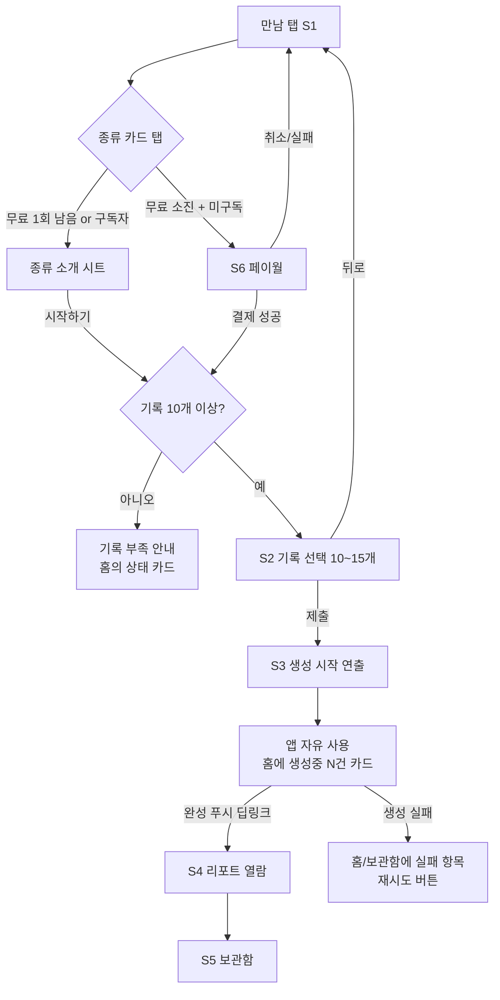

# 수익화 (프리미엄 구독) UI/UX 기획

- 작성일: 2026-07-06 / 상태: 확정 (오픈 이슈 3건 제외)
- 연관 문서: [수익화-기능기획.md](./수익화-기능기획.md)

## 0. 전제 (기능 기획에서 확정된 사실)

- 프리미엄 구독 (월+연, RevenueCat). 혜택: AI 리포트 무제한(월 10회 한도) + 광고 제거 (+테마는 M4)
- 무료 사용자는 앱 전체 무료, AI 리포트만 평생 통합 1회
- 리포트: 종류 선택(사고패턴/따뜻한 회고) → 기록 10~15개 직접 선택 → 비동기 생성 + 완성 푸시
- 현 브랜치에 분석 UI가 구현돼 있으나 **미완성(WIP)이며, 이 기획은 기존 구현을 참고하지 않고 백지에서 설계**한다. 설계 확정 후 현 구현과 비교하여 수용/수정 판단 (사용자 지시)
- 이번 UX 범위: **AI 분석 전체 플로우**(진입~종류 선택~기록 선택~생성 대기~결과~과거 리포트) + **구독 표면**(페이월, 구독 게이트, 설정 내 구독 관리, 무료 1회 안내). 광고 제거는 UI 없음(미노출), 테마·꾸미기는 M4 별도 기획
- 재사용 가능한 프로젝트 공통 자산(테마 토큰, 폰트, 공용 버튼/다이얼로그 등)은 그대로 쓴다 — 화면 설계만 백지

## 1. 사용 맥락 (확정)

- **기기**: 모바일 전용 (iOS/Android), 세로 고정. 한 손 조작 전제 — 주요 CTA는 하단부
- **사용 상황**: 하루 한 질문에 답하는 조용한 개인적 순간. 분석은 "나를 만나는 시간" — 서두르지 않는 사용
- **톤앤매너**: 기능명 대신 만남/경험의 서사 언어 (예: "이번 달의 당신을 만나러 가볼까요"). 판매 화면(페이월)도 이 톤 유지
- **경험 무게: 의식(ritual)형 몰입** — 진입부터 결과까지 하나의 의식처럼 연출. 화면당 정보 적게·여백 크게, 결과는 편지/리포트 형식의 긴 글, 생성 대기도 경험의 일부. 유료 가치감을 높이는 방향

## 2. 정보 구조 (확정)

### 화면 목록

| # | 화면 | 목적 | 진입 경로 | 딥링크 |
|---|---|---|---|---|
| S1 | 나를 만나는 시간 홈 | 종류 선택 카드, 상태 게이트, 보관함 진입 | 탭바 4번째 탭 | — |
| S2 | 기록 선택 | 답변 10~15개 직접 선택 | S1 종류 카드 | — |
| S3 | 생성 시작 연출 | 요청 접수 + "완성되면 알려드릴게요" | S2 제출 직후 | — |
| S4 | 리포트 열람 | 편지형 결과 본문 | 완성 푸시 / S5 / S1 | **필요** (푸시 → 리포트 ID) |
| S5 | 보관함 | 과거 리포트 목록 (영구 열람) | S1 | — |
| S6 | 페이월 | 구독 판매 (월/연) | 구독 게이트 / S7 | — |
| S7 | 설정 > 구독 관리 | 상태 표시, 복원, 해지 안내 | 설정 탭 | — |

### 내비게이션

- **탭바 4개: 홈 / 피드 / 만남(나를 만나는 시간) / 설정** — 유료 핵심 가치 상시 노출
- 종류 선택은 별도 화면 없이 S1 홈의 카드 2장으로 처리
- **페이월은 풀스크린 모달** (아래서 위로) — 혜택 서사, 플랜 2종, 복원·약관까지 수용, "초대장" 연출

## 3. 핵심 플로우 (확정)



### 분기 결정

- **페이월 게이트 시점**: 무료 소진 사용자가 **종류 카드를 탭하는 즉시** 페이월. 카드에는 잠금 상태를 미리 표시해 기만감 방지. 기록 선택 노동 후에 과금을 알리는 방식은 채택 안 함
- **결제 성공 후**: 페이월이 닫히며 **하던 흐름을 이어감** — 종류 카드에서 왔으면 바로 S2 기록 선택으로. 설정(S7)에서 왔으면 S7로 복귀
- **동시 생성: 여러 건 허용** (월 10회 한도 내). 생성 중에도 종류 카드는 잠기지 않음. 홈에 "만나러 가는 중 N건" 상태 카드, 완성 푸시는 건별 발송·건별 딥링크
- **실패**: 실패한 건은 홈 상태 카드와 보관함에 실패 상태로 남고 재시도 가능. 무료 1회는 차감되지 않음(기능기획 확정)을 문구로 안심시킴
- **재진입**: 생성 중 앱을 떠나도 상태는 서버 기준으로 복원. 푸시를 놓쳐도 홈 상태 카드와 보관함에서 완성본 확인 가능

## 4. 화면별 상세 설계

### S1. 만남 탭 홈 — "나를 만나는 시간" (확정: 종류 카드 중심)

```
┌──────────────────────┐
│ 나를 만나는 시간      │  ← 제목
│ 오늘은 누구를 만날까요? │  ← 부제 (서사 카피)
│ ▸ 만나러 가는 중 1건   │  ← 상태 배너 (있을 때만)
│ ┌────────────────┐   │
│ │ 🧠 사고의 지도    │   │  ← 종류 카드 1 [가정: 카드명 카피]
│ └────────────────┘   │
│ ┌────────────────┐   │
│ │ 💌 따뜻한 회고    │   │  ← 종류 카드 2
│ └────────────────┘   │
│ 지난 만남 보기 →      │  ← S5 보관함 진입
└──────────────────────┘
```

- **첫 시선**: 종류 카드. **Primary CTA**: 종류 카드 탭
- 카드 하단에 자격 상태를 소형 배지로: 무료 미사용 = "첫 만남은 선물이에요" / 무료 소진+미구독 = 🔒 "구독으로 이어가기" / 구독자 = 배지 없음
- **상태 4종**: 정상 = 위 레이아웃 / empty(기록 10개 미만) = 카드 위에 "아직 이야기가 부족해요 — 기록이 N개 더 쌓이면 만날 수 있어요" 안내 카드, 종류 카드는 비활성(흐림) / 로딩 = 카드 스켈레톤 / 에러 = "잠시 연결이 어려워요" + 재시도 버튼
- 생성 중 배너 탭 → S5 보관함(생성중 항목이 보이는 곳)

### S2. 기록 선택

- 레이아웃: 상단 헤더(뒤로 + "함께 읽을 기록 고르기") / 안내 한 줄("10~15개의 기록을 골라주세요") / 날짜·질문·답변 요약 리스트(체크 선택) / **하단 고정 바**: 선택 카운터("7개 선택") + 제출 버튼
- **Primary CTA**: 하단 "이 기록으로 만나기" 버튼 — 10개 미만이면 비활성, 15개 도달 시 추가 선택 차단 + "최대 15개까지 함께 읽을 수 있어요"
- 상태 4종: 정상 리스트 / empty = 진입 전 게이트로 차단되므로 방어적 문구만 / 로딩 = 리스트 스켈레톤 / 에러 = 인라인 재시도
- 무한 스크롤(과거 기록), 최신순

### S3. 생성 시작 연출

- 풀스크린 한 장: 일러스트 + "당신의 기록을 읽으러 갑니다" + "완성되면 알려드릴게요. 보통 몇 분이면 충분해요"
- **Primary CTA**: "기다리는 동안 둘러보기" → S1 복귀. [가정] 자동 전환 없음, CTA로만 닫음
- 알림 미허용 사용자에게는 이 화면에서 알림 허용 유도 한 줄 추가

### S4. 리포트 열람 (확정: 종류별 차등 — 회고=편지형, 사고=요약+섹션형)

- **따뜻한 회고**: 인사말("6월 12일의 당신에게")로 시작해 맺음말로 끝나는 한 통의 편지 (통글)
- **사고의 지도**: 요약 한 단락 + 섹션형(패턴/감정/관점 등) — 분석적 정보에 맞는 구조. 단, 톤은 동일한 서사 언어 유지
- 말미 CTA: "다음 만남 예약하기" → S1 [가정: 명칭·동작]
- 상태 4종: 정상 / 생성중 진입 시 = "아직 읽고 있어요" 대기 화면 / 실패 = "다시 만나러 가기" 재시도 (무료 1회 차감 안 됨 안내) / 에러(네트워크) = 재시도
- 딥링크: 완성 푸시 → 이 화면 (리포트 ID)

### S5. 보관함 — "지난 만남"

- 리스트: 종류 심볼 + 제목 + 날짜 + 상태(완료/생성중/실패). 탭 → S4
- empty: "아직 만난 적이 없어요. 첫 만남은 선물이에요" + 새 만남 시작 버튼(→S1)
- 로딩 스켈레톤 / 에러 재시도. 구독 만료자도 완료본은 열람 가능(기능기획 확정)

### S6. 페이월 (확정: 풀스크린 모달, 연 플랜 기본 선택)

```
┌──────────────────────┐
│ ✕                    │
│   💌 (일러스트)        │
│  나를 만나는 시간을     │
│  계속 이어가세요        │
│  ✓ 매달 새로운 만남 (월 10회) │
│  ✓ 광고 없는 기록      │
│  ✓ 공개 예정 혜택(테마) │
│ ┌────────┐┌─────────┐ │
│ │월 플랜  ││◉연 -nn% │ │  ← 연 기본 선택 + 절약 배지
│ └────────┘└─────────┘ │
│ [구독 시작하기]         │
│  구매 복원 · 이용약관    │
└──────────────────────┘
```

- **첫 시선**: 서사 헤드라인. **Primary CTA**: "구독 시작하기"
- 상태: 결제 진행 = 버튼 로딩 / 실패·취소 = 모달 유지 + 인라인 "결제가 완료되지 않았어요" / 상품 로딩 실패 = 재시도
- 닫기(✕)는 항상 제공 — 강제 노출 없음

### S7. 설정 > 구독 관리

- 미구독: "프리미엄 — 나를 만나는 시간을 계속" 행 → S6
- 구독 중: 현재 플랜 / 다음 갱신일 / [스토어에서 관리] (해지 안내) / [구매 복원]
- 만료: "구독이 끝났어요 — 다시 이어가기" → S6

## 5. 인터랙션 규칙 (확정)

- **S2 뒤로가기**: 확인 없이 즉시 나감. 선택은 폐기 (임시 저장 없음)
- **결제 성공**: 페이월이 절제된 환영 화면("이제 언제든 만나러 갈 수 있어요")으로 전환 후 하던 흐름 계속. 컨페티 등 과한 연출 없음
- **결제 실패/취소**: 페이월 유지 + 인라인 메시지. 토스트 아닌 화면 내 표시
- **애니메이션**: 의식 지점(S3 생성 연출, S4 편지 등장, 결제 환영)만 Reanimated 적극 활용. 리스트·화면 전환은 기본만
- **피드백 일반**: 분석 요청 성공은 S3 화면 자체가 피드백. 파괴적 액션 없음(삭제 기능 비범위)
- **접근성**: 터치 타깃 44pt 이상, 종류 카드·플랜 카드는 선택 상태를 색+테두리+아이콘 이중 표시, 편지 본문은 시스템 폰트 크기 설정 존중

## 6. 비주얼 방향 (확정)

- **기존 디자인 시스템 전면 재사용**: 테마 토큰(라이트/다크+액센트), Text/Button 등 공용 컴포넌트, 반응형 유틸(sp/radius)
- 종류별 컬러 워시 개념 유지: 사고 = 쿨톤, 회고 = 웜톤 (라이트/다크 각각)
- 일러스트는 기존 캐릭터 자산(여우·코알라 등) 재사용, 새 라이브러리·폰트·아이콘 도입 없음

## 6.5 확정된 가정

1. S1 종류 카드명: "사고의 지도" / "따뜻한 회고"
2. S3은 자동 전환 없음, "둘러보기" CTA로만 닫음
3. S4 말미 CTA "다음 만남 예약하기" → S1
4. 탭바 라벨: "만남"
5. 일러스트는 기존 캐릭터 자산 재사용

## 7. 구현 순서 및 오픈 이슈

### 구현 순서 (기능기획 마일스톤과 정렬)

1. S1(게이트·상태 포함) → S2 → S3 → S4 → S5 — M1(AI 리포트 E2E)에 대응
2. S6 페이월 + 결제 환영 화면 + S7 구독 관리 — M2(결제)에 대응
3. 의식 지점 애니메이션 폴리시 — M1·M2 안정화 후

### 오픈 이슈

1. 페이월 절약 배지 % 문구 — 가격 확정(기능기획 오픈 이슈) 후 결정
2. S4 편지 본문의 실제 카피 시스템(소제목 구조, 길이 가이드) — AI 프롬프트 설계와 함께 결정
3. 리포트 완성 푸시 문구 — 알림 기획과 함께

## 8. 현 구현(WIP 브랜치)과의 비교

설계 확정 후 기존 구현을 검토한 결과. (사용자 지시: 백지 설계 → 사후 비교)

### 일치 — 그대로 수용

| 항목 | 비고 |
|---|---|
| 전용 탭 + 종류 카드 2장 중심 홈 | `analysis/index.tsx` + `AnalysisBigCard` 구조 동일 |
| 기록 선택: 리스트 + 하단 고정 바(카운터, 10~15 검증) | `select.tsx` 가 설계와 사실상 동일. 뒤로가기 즉시 나감도 일치 |
| 종류별 컬러 워시(쿨/웜), 캐릭터 일러스트, 서사 카피 체계(i18n) | `analysisTypes.ts` CARD_PALETTES |
| 비동기 생성 + 푸시 유도(pre-prompt) | `useAnalysisPushPrompt` |
| 보관함·결과 화면, PROCESSING/FAILED 상태 분기, 리포트 딥링크 라우트 | `history.tsx`, `[id].tsx` |

### 차이 — 수정 필요 (설계가 우선)

1. **가용성 모델**: 구현은 `COOLDOWN`(주 1회) + `PROCESSING`(진행 중이면 차단). 확정 기획은 **동시 여러 건 + 월 10회 한도 + 무료 통합 1회 + 구독 게이트**. → `AvailabilityReason`에서 COOLDOWN·PROCESSING 차단을 제거하고 `NEEDS_SUBSCRIPTION` / `QUOTA_EXCEEDED` 추가, 홈 게이트 UI 교체
2. **S3 생성 시작 연출 부재**: 구현은 제출 → 홈 복귀 + 상태 카드뿐. 의식형 S3 화면 신규 필요
3. **구독 표면 전무**: S6 페이월, S7 구독 관리, 무료 1회 배지, 결제 환영 화면 모두 신규
4. **결과 형식 충돌**: 구현은 사고패턴 = 섹션형(`ThinkingPatternResult`), 회고만 편지형. 설계 확정은 "편지형 통글" 통일 → 사용자 확인 결과 **종류별 차등 유지**로 확정 (설계 §4 S4 수정됨)
5. 카피: 구현 "사고 패턴/따듯한 위로" vs 확정 "사고의 지도/따뜻한 회고" — i18n 갱신
6. 소소: 보관함 엔트리 위치(구현 상단 / 설계 하단), 종류 소개 시트는 **유지**로 확정 (무료 소진자는 시트 대신 페이월)

### 비교에서 나온 충돌의 해소 (확정)

- **결과 형식: 종류별 차등 유지** — 사고의 지도 = 요약+섹션형, 따뜻한 회고 = 편지형. 현 구현 구조 수용, §4 S4에 반영됨
- **종류 소개 시트: 유지** — 카드 탭 → 소개 시트("초대장") → 기록 선택. 무료 소진+미구독자는 시트 대신 페이월로 분기 (§3 플로우의 게이트 지점 = 카드 탭 즉시, 변동 없음)
